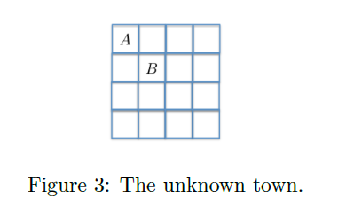

You are a bank robber trying to heist the bank of an unknown town. You enter the town at
position A (see Figure 3), the police starts from the opposite corner, and the bank is at position
B. For each round spent in the bank, you receive a reward of 1 SEK. The police walks randomly
(that is, uniformly at random up, down, left or right) across the grid and whenever you are caught
(you are in the same cell as the police) you lose 10 SEK.
You are new in town, and hence oblivious to the value of the rewards, the position of the bank,
the starting point and the movement strategy of the police. Before you take an action (move up,
down, left, right or stand still), you can observe both your position and that of the police. Your
task is to develop an algorithm learning the policy that maximizes your total discounted reward
for a discount factor .
