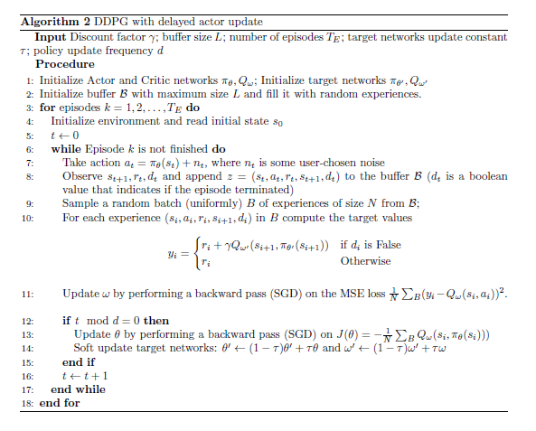

In this scenario we will work with the continuous action-space version of the LunarLander problem.
We will use the LunarLanderContinuous-v2 simulator. We also provide you with the file
DDPG_problem.py which contains a simple script to run the environment.We will use DDPG, Deep Deterministic Policy Gradient, an off-policy model-free
RL algorithm that is used in environments with continuous action space. DDPG is an actor-critic
method, where the actor is updated by means of the deterministic policy gradient. 
 
