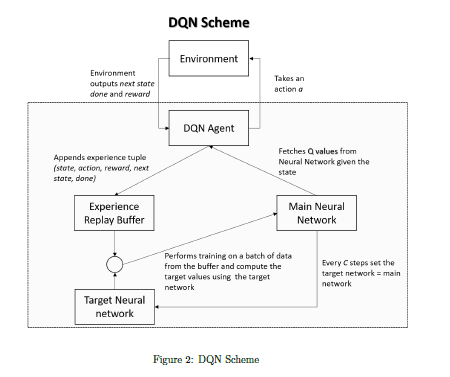
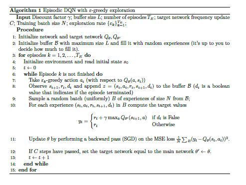

In this scenario we will work with the discrete action-space version of the LunarLander problem.
Solving this exercise is hard by means of classical reinforcement learning methods. The model is unknown,
and the state space is continuous. Since the action space is finite, we will solve this exercise
using Deep-Q-Networks (DQN). To simulate the environment we will use the LunarLander-v2 from
the OpenGym library (check https://gym.openai.com/docs/ to get started with OpenGym). We
provide you the file DQN_problem.py which contains a simple script to run the environment. To
verify correctness of your policy, we also provide you a file DQN check solution.py that you can
use to verify performance of your policy. 

 
