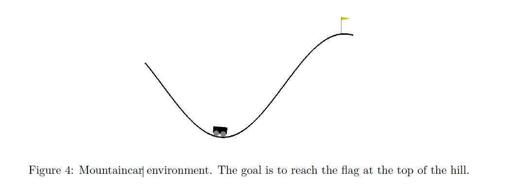

Your goal is to solve the MountainCar environment5 using linear function approximators. The
MountainCar environment is an example of environment where the state-space is continuous and
the action space is discrete. Specifically, the state s is a 2-dimensional variable, where the first
dimension s1 represents position, with -1.2<=s1<=0.6 and s2 represents velocity, with -0.07<=
s2<=0.07.
There are 3 actions: push left (0), no push (1) and push right (2). The environment is episodic, and
you will have to train over multiple episodes. At the beginning of each episode the cart will spawn
in a random position between -0.6 and -0.4 at the bottom of the hill, with 0 velocity.
For each action taken you will get a reward of -1 until the goal position (shown in the figure,
position 0:5) is reached. You have at most 200 actions to reach the top of the hill. An episode
terminates either if: (I) 200 actions have been taken or (II) if the cart reached the goal position.
Clearly, the goal is to make the cart reach the 
ag at the top of the hill.
The system is unknown to you: the dynamics, mass, friction and other parameters of the system are
not known. For this reason, you will use a model-free approach, Sarsa(), to solve the task.
