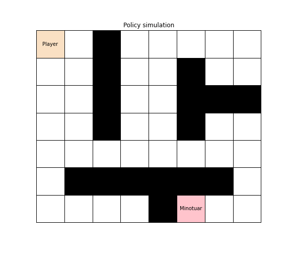
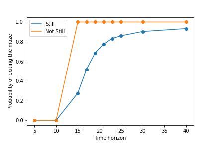
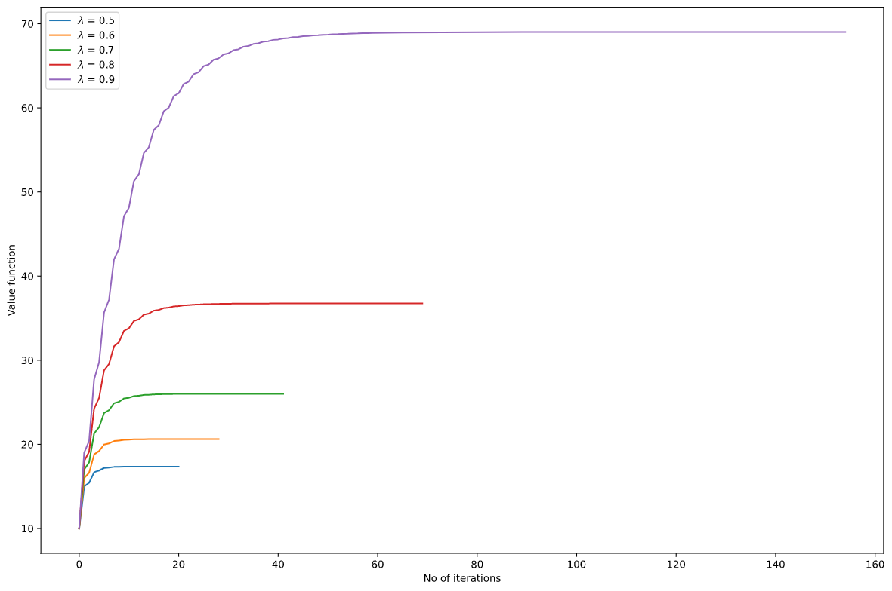
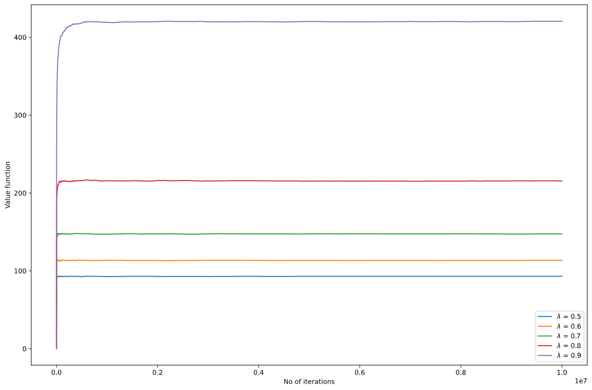
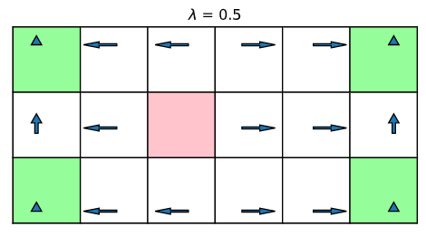
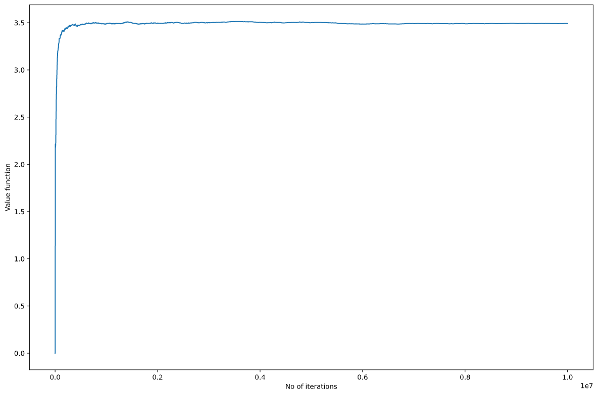
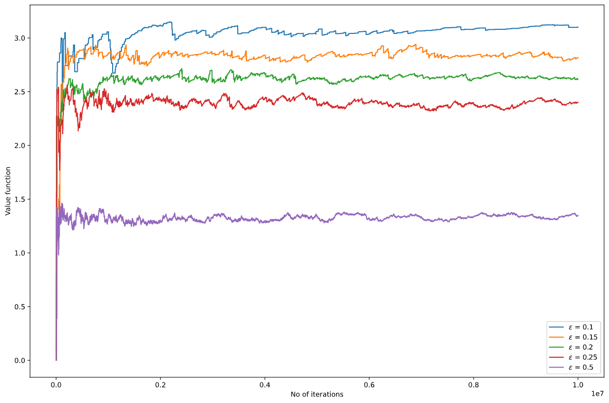
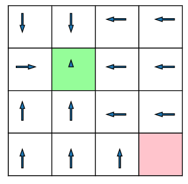
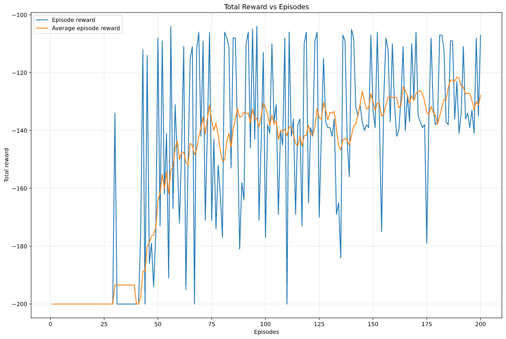
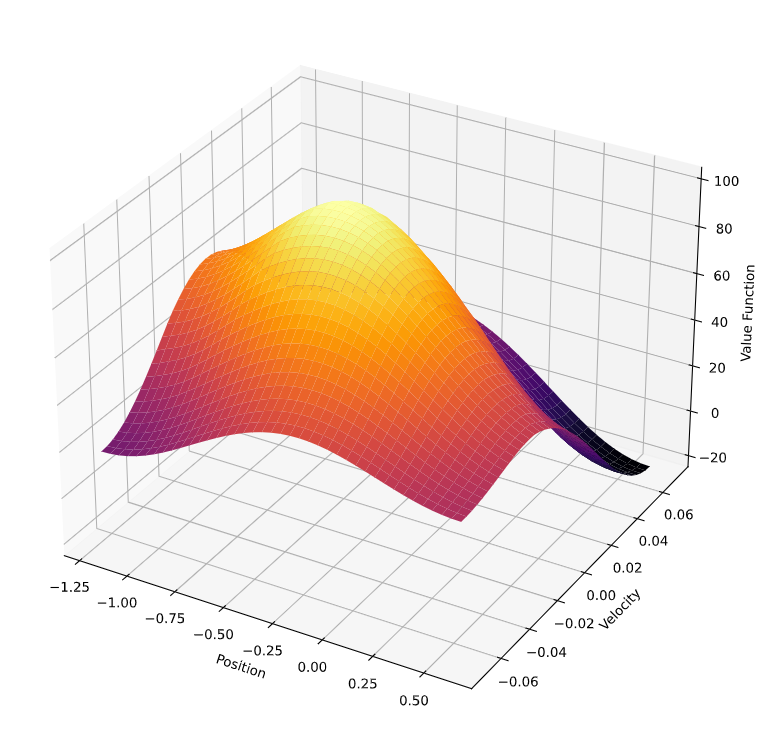

conda create --name <env> --file requirements.txt

# RESULTS

## Escaping the Maze : Fixed Time Horizon using Dynamic Programming

</img></img>

##  Escaping the Maze : Infinite time horizon : 
1. 

<table>
  <tr>
    <td>MDP-Value Iteration</td>
     <td>Model free-Qlearning</td>
     <td>Optimal Policy</td>
  </tr>
  <tr>
    <td></img></td>
    <td></img></td>
    <td></img></td>
  </tr>
 </table>

##  Escaping the police : Infinite time horizon :

<table>
  <tr>
    <td>Q learning </td>
     <td>SARSA with epsilon greedy</td>
     <td>Optimal Policy</td>
   
  </tr>
  <tr>
    <td></img></td>
    <td></img></td>
    <td></img></td>
  </tr>
 </table>

##  Mountain Car : SARSA with Eligibility Traces (Linear Function Approximations using Fourier basis)

<table>
  <tr>
    <td>Reward over episodes</td>
     <td>Cost to go</td>
   
  </tr>
  <tr>
    <td></img></td>
    <td></img></td>
   
  </tr>
 </table>

 ## Deep Q-Networks (DQN) - LunarLander discrete

 <table>
  <tr>
    <td>Episodic reward and steps</td>
     <td>Effect of discount factor</td>
   
  </tr>
  <tr>
    <td></img></td>
    <td></img></td>
   
  </tr>
 </table>

  ## Deep Deterministic Policy Gradient (DDPG) - LunarLander Continous

 <table>
  <tr>
    <td>Episodic reward and steps</td>
     <td>Effect of discount factor</td>
   
  </tr>
  <tr>
    <td></img></td>
    <td></img></td>
   
  </tr>
 </table>