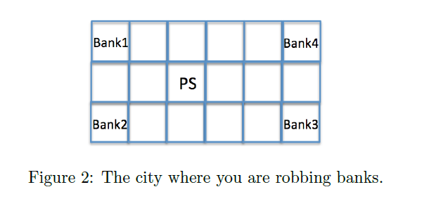

At time 0, you are robbing Bank 1 (see Figure 2), and the police gets alerted and starts chasing
you from the point PS (Police Station). You observe where the police is, and decide in each step
either to move up, left, right, down or to stay where you are. Each time you are at a bank, and the
police is not there, you collect a reward of 10 SEK. If the police catches you, you loose 50 SEK,
and the game is reinitialised (you go back to Bank 1, and the police goes back to the PS).
The police always chases you, but moves randomly in your direction. More precisely, assume that
the police and you are on the same line, and without loss of generality, that the police is on your
right; then the police moves up, down and left with probability 1/3. Similarly, when the police
and you are on the same column, and when your are above the police, then the police moves up,
right and left with probability 1/3. When the police and you are not on the same line, nor on the
same column, say the police is below you and on your right, then the police moves up and left with
probability 1/2.
The rewards are discounted at rate  , and your objective is to maximise your average
discounted reward. 
