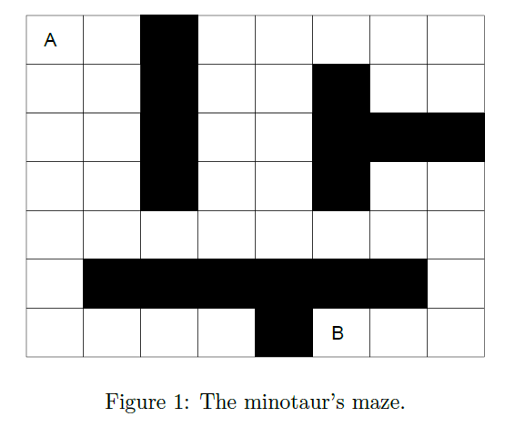

Consider the maze in Figure 1. You enter the maze in A and at the same time, the minotaur
enters in B. The minotaur follows a random walk while staying within the limits of the maze. The
minotaur's walk goes through walls (which obviously you cannot do). At each step, you observe the
position of the minotaur, and decide on a one-step move (up, down, right or left) or not to move.
If the minotaur catches you, he will eat you.3 Your objective is to identify a strategy maximizing
the probability of exiting the maze (reaching B) before time T. 
<b>Note 1:</b> Neither you nor the minotaur can walk diagonally. 
<b>Note 2:</b>The minotaur catches you, if and only if, you are located at the same position, at the
same time.

