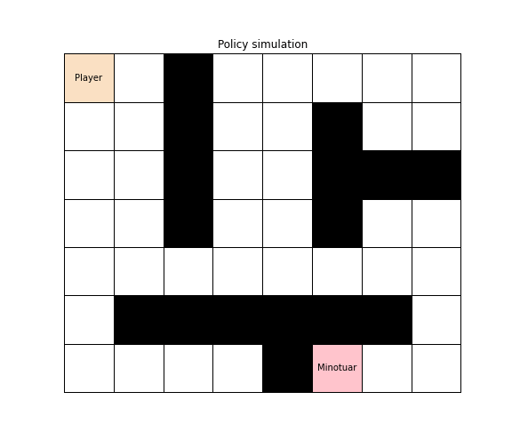
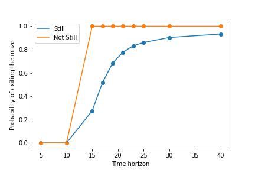
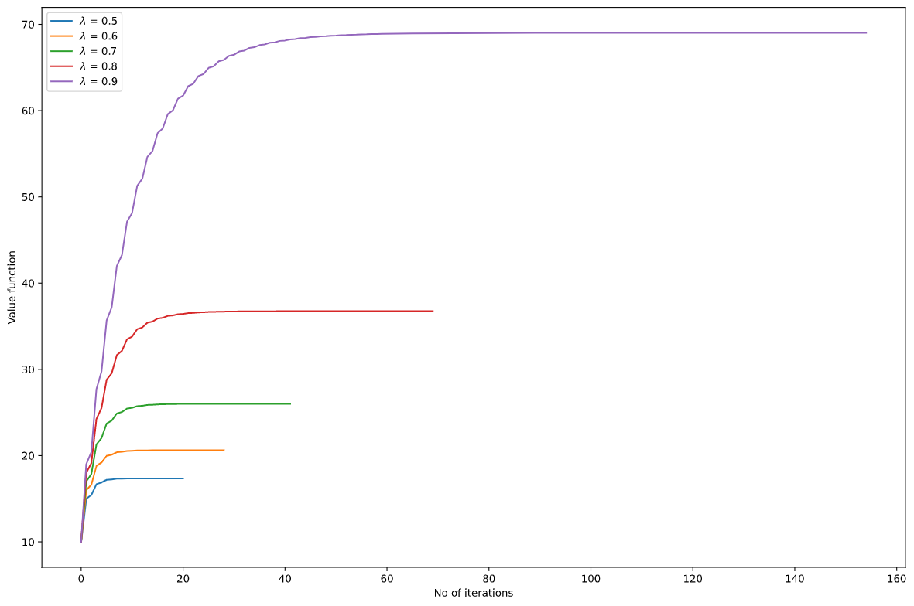
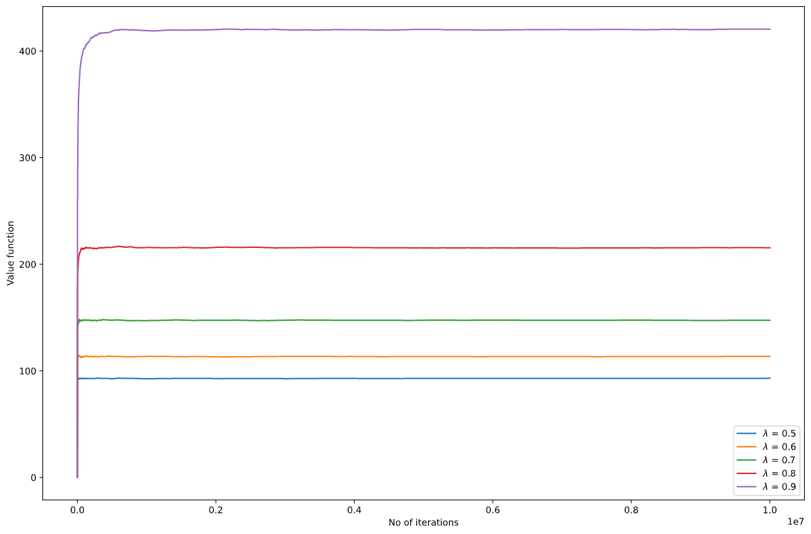
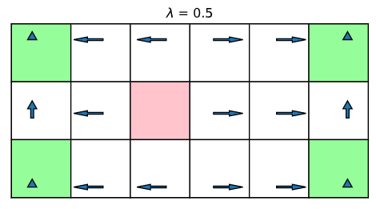
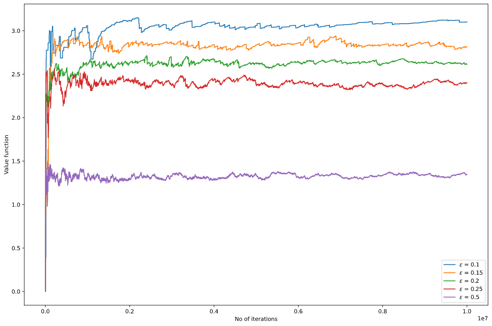
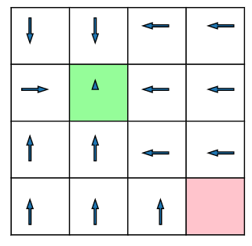
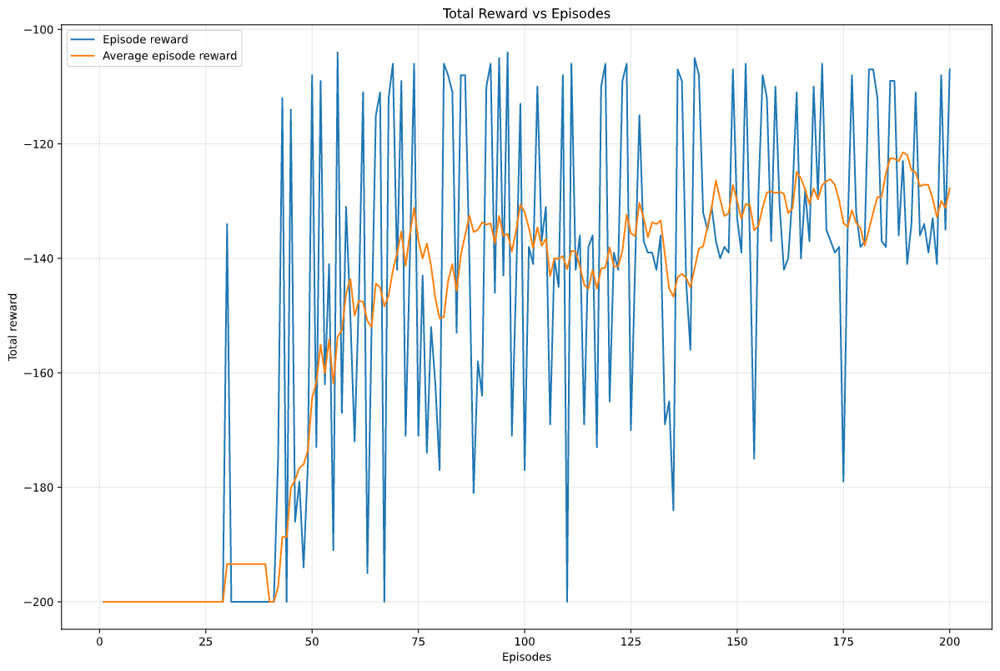
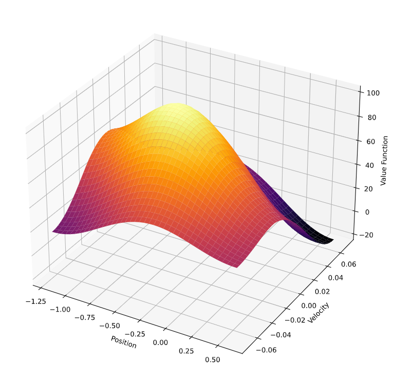

conda create --name <env> --file requirements.txt

# RESULTS

## Escaping the Maze : Fixed Time Horizon using Dynamic Programming

</img></img>

##  Escaping the Maze : Infinite time horizon : 
1. MDP - Value Iteration

</img>

2. Model free - Q learning

</img>

3. Optimal Policy 

</img>

##  Escaping the police : Infinite time horizon :

1. Q learning 

</img>

2. SARSA with epsilon greedy

</img>

3. Optimal Policy

</img>

##  Mountain Car : SARSA with Eligibility Traces (Linear Function Approximations using Fourier basis)

</img></img>

